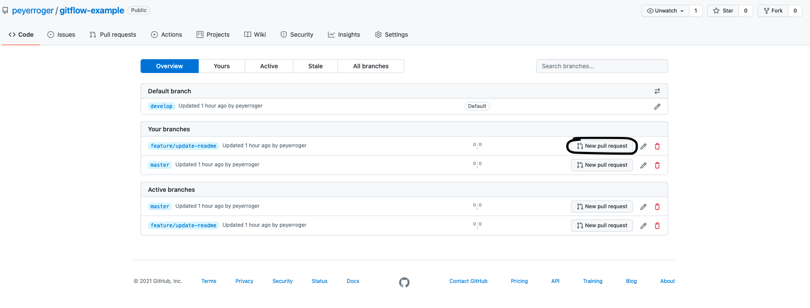
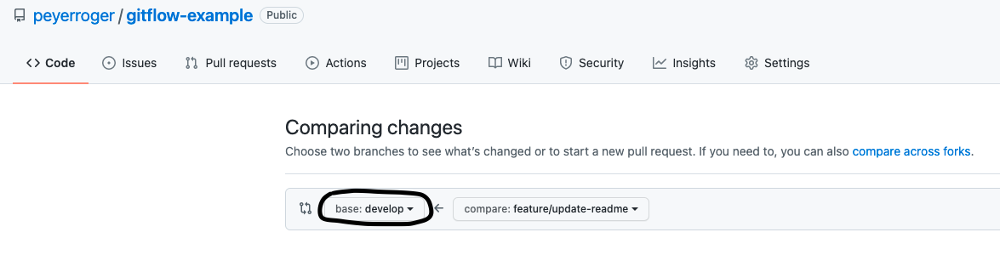
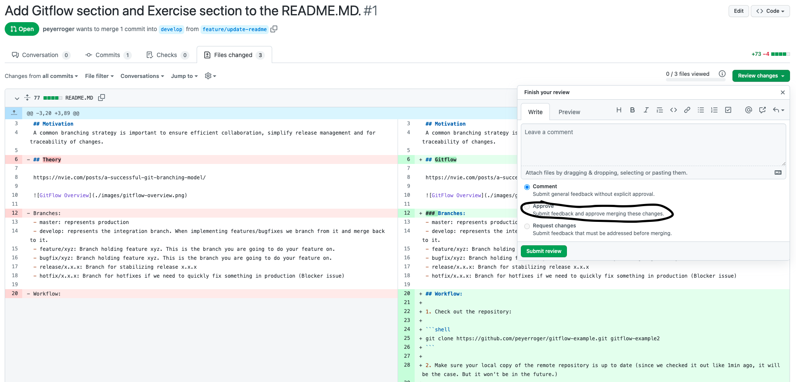
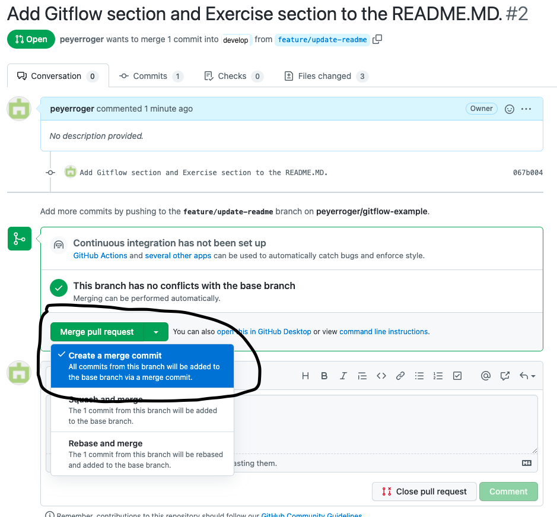
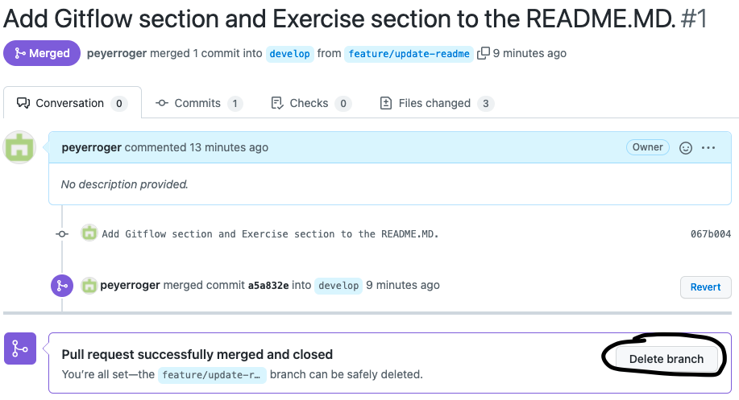

# Gitflow Example

## Motivation
A common branching strategy is important to ensure efficient collaboration, simplify release management and for traceability of changes.

## Gitflow

https://nvie.com/posts/a-successful-git-branching-model/


### Branches:
- master: represents production
- develop: represents the integration branch. When implementing features/bugfixes we branch from it and merge back to it.
- feature/xyz: Branch holding feature xyz. This is the branch you are going to do your feature on.
- bugfix/xyz: Branch holding feature xyz. This is the branch you are going to do your feature on.
- release/x.x.x: Branch for stabilizing release x.x.x
- hotfix/x.x.x: Branch for hotfixes if we need to quickly fix something in production (Blocker issue)

## Workflow:

1. Check out the repository:

```shell
git clone https://github.com/peyerroger/gitflow-example.git gitflow-example2
```

2. Make sure your local copy of the remote repository is up to date (since we checked it out like 1min ago, it will be the case. But it won't be in the future.)

```shell
git fetch
```

3. Create a new feature branch from the develop branch.
The command below will check out origin/develop (which is your local copy of it. Since we did git fetch, it is also the state of the branch in the remote repository) and create the local branch feature/xyz from it.

```shell
git checkout -b feature/xyz origin/develop
```

4. Add your skills to your personal file /people/<your-name>.md

5. Add your changes to the staging area.
The first command will only add exactly this file.
If you want to add all changed file use the second command.
```shell
git add people/<your-name>.md
git add *
```
6. Commit your changes
```shell
git commit -m "Updated skills of <your-name>"
```

7. We are now ready to push our changes.
But before we actually do this, we should make sure that our branch has all the changes from the remote.
In case we got conflicts we need to resolve the first. (Note that git pull is a shortcut for git fetch and git merge)

```shell
git pull
```

8. (Optional) Resolve conflicts and then execute the following commands:
```shell
git add *
git commit -m "Fixed conflicts"
```

9. Push your feature to the repository.
```shell
git push origin refs/heads/feature/xyz:feature/xyz
```

10. Create a Pull Request



Select the target branch. In our case develop.



11. Review someone else's PR



12. Integrate your PR



14. Clean up your feature branch



Once you've checked out a new branch, delete your old feature branch. (You cannot delete your current branch)
```shell
git branch -d feature/xyz
```

15. Fetch the latest changes locally.

```shell
git fetch
```

16. (Roger only) Create a release branch

```shell
git checkout -b release/0.2.0 origin/develop
```

17. (Roger only) Fix the bug
```shell
git add *
git commit -m "Fixing issue xyz"
```

18. Push the release branch

```shell
git push origin refs/heads/release/0.2.0:release/0.2.0
```

19. Bring back changes to develop by creating a PR release/0.2.0 -> develop.

20. Create a PR release/0.2.0 -> master

21. Tag the commit

23. Deploy to production


